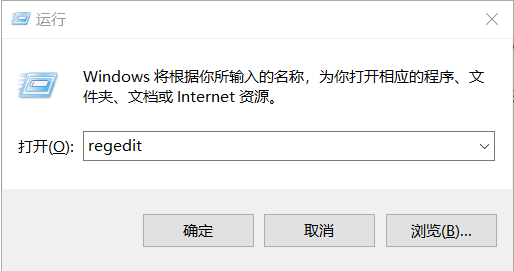
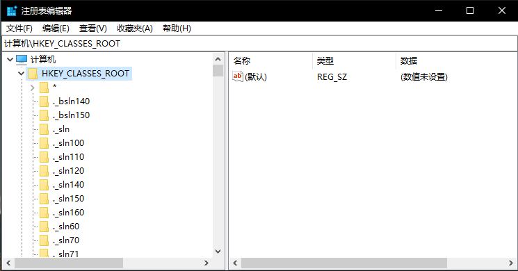
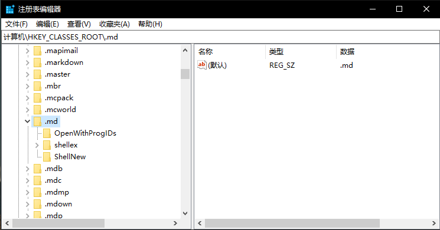
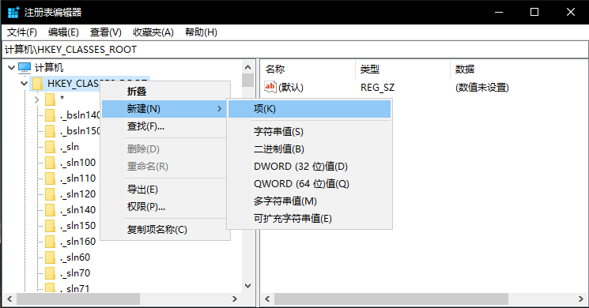
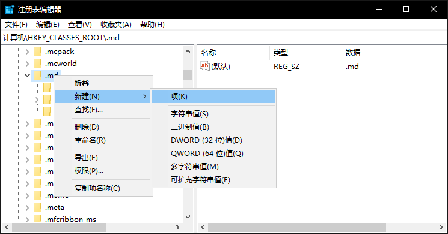
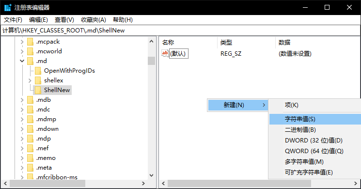
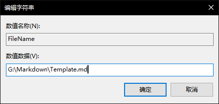

# 添加右键新建菜单

## 1.打开注册表编辑器

win+R 

输入: ***regedit***

打开注册表编辑器

## 2. 选择你要新建的文件类型

- 打开**HKEY_CLASSES_ROOT**

- 找到你要新建的文件类型(以md文件为例)

- 若不存在则新建

右键HKEY_CLASSES_ROOT，新建，项，重命名为.md

## 3.添加右键新建菜单

- 右键.md，新建，项，重命名为 **ShellNew**

---

- 在 **ShellNew** 项内部，右键，新建，字符串值，命名为 **FileName** 

**现在新建菜单中就已经成功添加。**

## 4.添加模板文件

**某些文件可能需要一个模板文件**，如Word文档需要一个固定的模板，而不是空文件。

==如果不需要模板文件（只需一个空文件），则不需要进行以下操作。==

- 创建一个模板文件

  将来新建的文件将和模板文件相同。

- 双击 **FileName** 修改 **数值数据** 为模板文件的绝对地址

# 成功！

